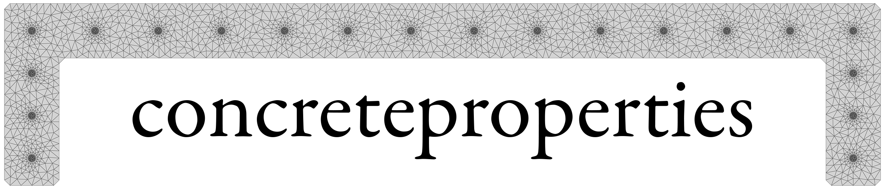
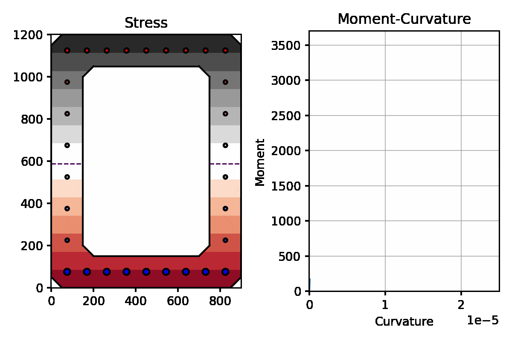

.. image:: _static/cp_logo_dark.png
    :class: only-dark

.. toctree::
    :hidden:

    installation
    user_guide
    examples
    api

.. toctree::
    :caption: Development
    :hidden:

    contributing
    Code of Conduct <codeofconduct>
    License <license>
    Changelog <https://github.com/robbievanleeuwen/concrete-properties/releases>

Documentation
=============

``concreteproperties`` is a python package that can be used to calculate the section
properties of arbitrary reinforced concrete sections. ``concreteproperties`` can
calculate gross, cracked and ultimate properties. It can perform moment curvature
analyses and generate moment interaction and biaxial bending diagrams. On top of this,
``concreteproperties`` can also generate pretty stress plots!

Here's an example of some of the non-linear output ``concreteproperties`` can generate:

Installation
------------

You can install ``concreteproperties`` via `pip <https://pip.pypa.io/>`_ from
`PyPI <https://pypi.org/>`_:

.. code:: shell

   pip install concreteproperties

See :ref:`label-installation` for more information.

Features
--------

See the complete list of ``concreteproperties`` features :ref:`here<label-features>`.

Contributing
------------

Contributions are very welcome. To learn more, see the
:ref:`Contributor Guide<label-contributing>`.

License
-------

Distributed under the terms of the :doc:`MIT License <license>` ``concreteproperties``
is free and open source software.

Support
-------

Found a bug 🐛, or have a feature request ✨, raise an issue on the
GitHub `issue
tracker <https://github.com/robbievanleeuwen/concrete-properties/issues>`_.
Alternatively you can get support on the
`discussions <https://github.com/robbievanleeuwen/concrete-properties/discussions>`_
page.

Legacy Documentation
--------------------

The documentation for ``concreteproperties`` ``v0.5.x`` and earlier can be found
`here <https://robbievanleeuwen.github.io/concrete-properties/>`_.

Disclaimer
----------

``concreteproperties`` is an open source engineering tool that continues to benefit from
the collaboration of many contributors. Although efforts have been made to ensure the
that relevant engineering theories have been correctly implemented, it remains the
user's responsibility to confirm and accept the output. Refer to the
:doc:`License <license>` for clarification of the conditions of use.
